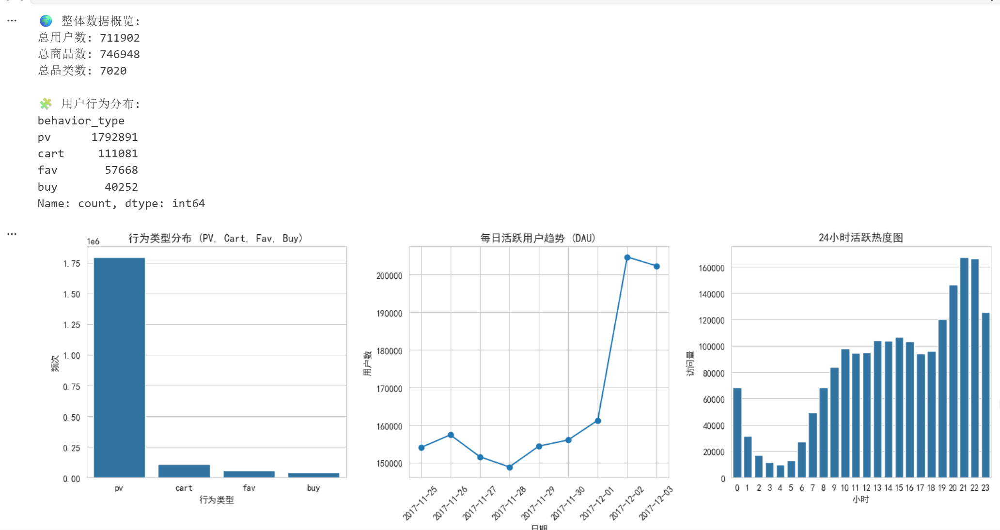
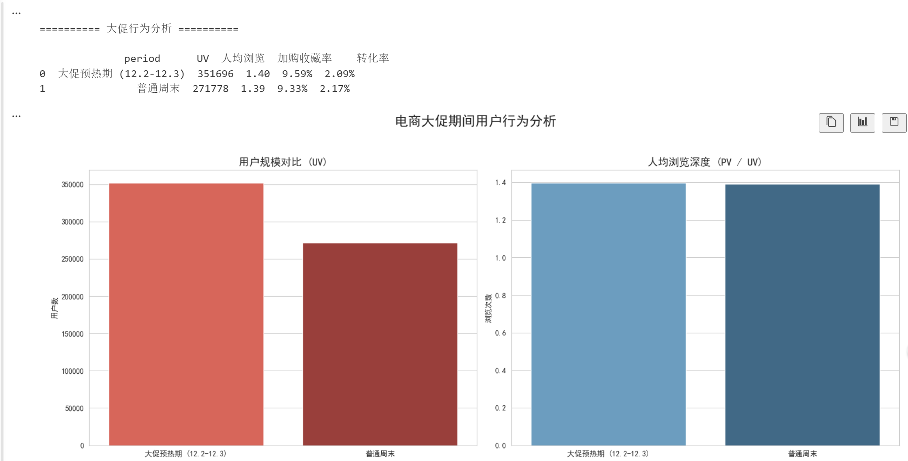
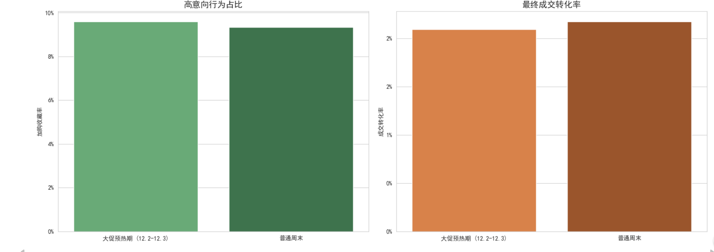
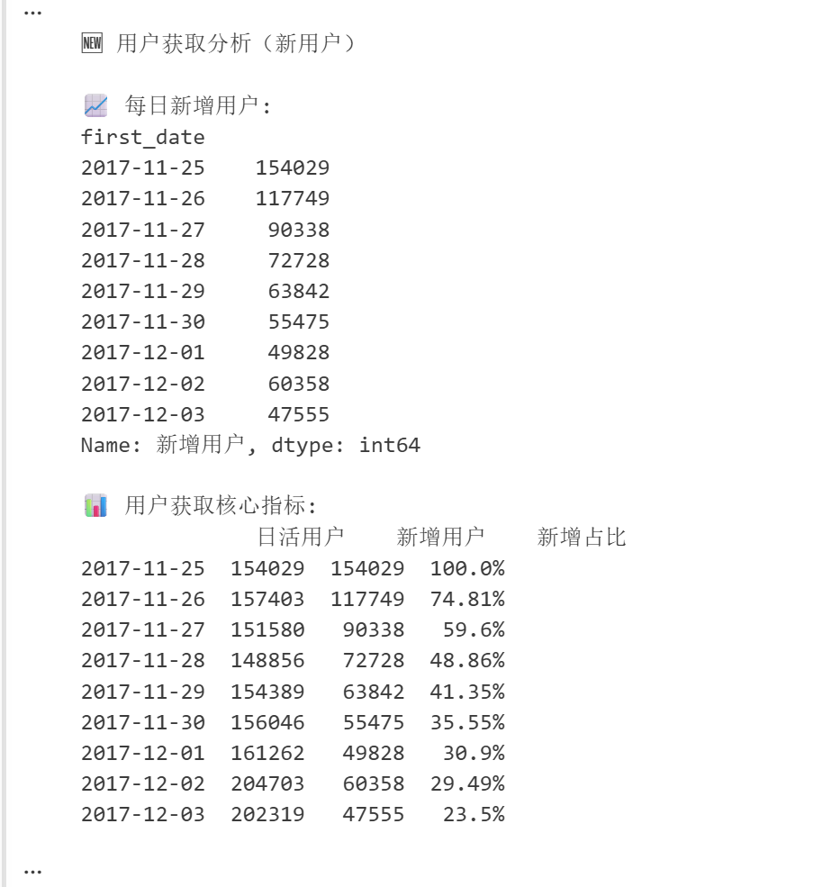
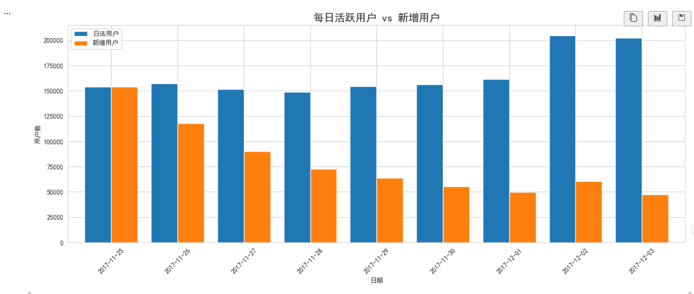
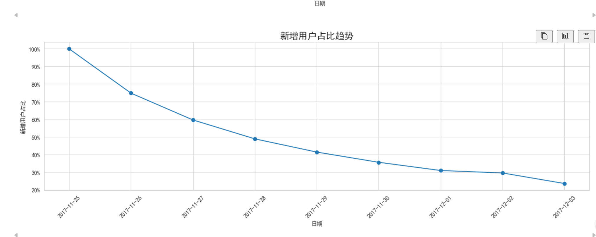
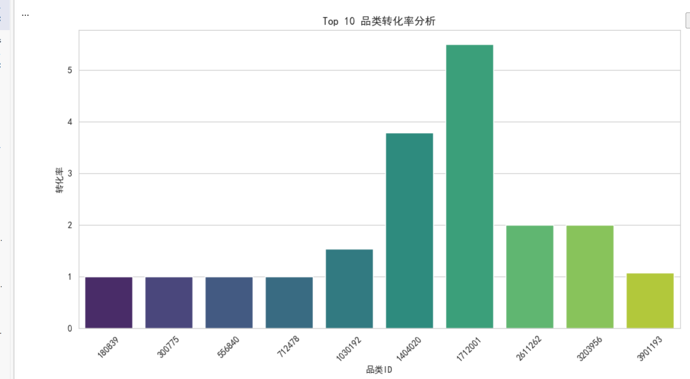
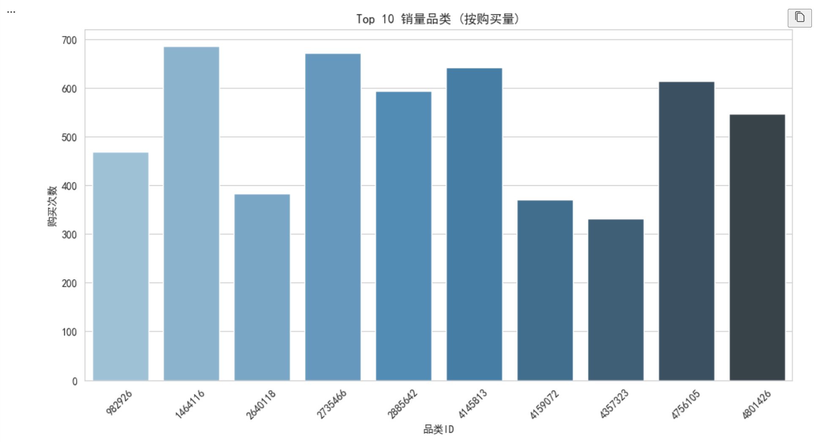
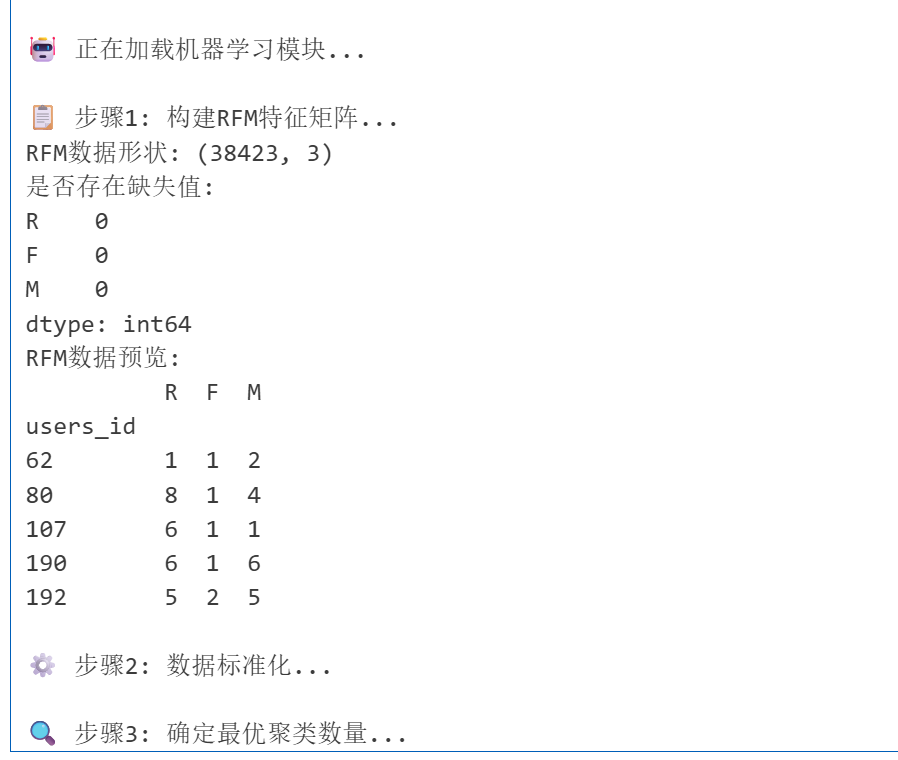
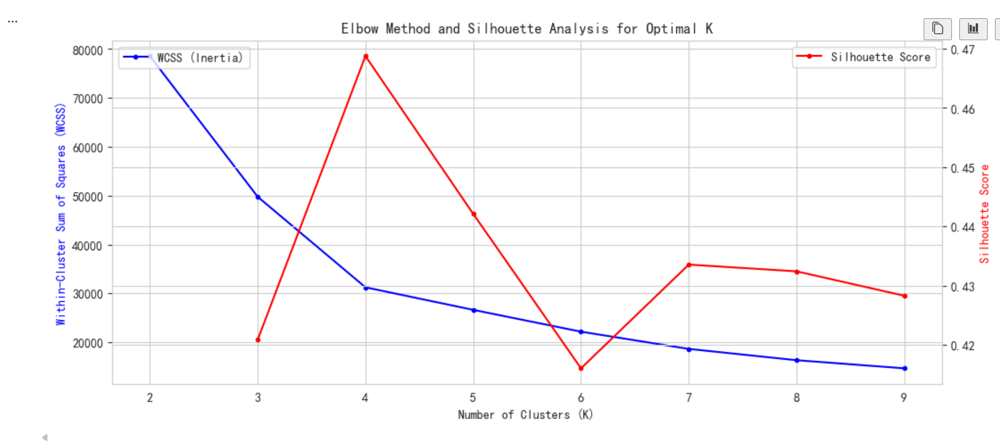

# 🛒 淘宝用户行为深度分析项目

## 📌 项目简介

本项目基于淘宝用户行为数据集，对用户浏览、收藏、加购、购买等行为进行深度分析，
通过数据清洗、用户行为分析、留存分析、转化漏斗分析、商品品类分析以及机器学习用户分层，
挖掘用户行为规律与用户价值，为电商平台运营与精准营销提供数据支持。

项目完整实现了从：

```text
数据清洗 → 数据分析 → 数据可视化 → 用户分层 → 业务建议
```

的一整套电商数据分析流程。

---

# 📂 项目结构

```text
taobao-user-analysis/
│
├── data/
│   └── user_behavior.csv
│
├── notebook/
│   └── taobao_user_analysis.ipynb
│
├── images/
│   ├── 01_overview_and_activity_charts.png
│   ├── 02_promotion_vs_weekend_uv_and_depth.png
│   ├── 03_promotion_intent_and_conversion_rate.png
│   ├── 04_user_acquisition_new_users.png
│   ├── 05_dau_vs_new_users_daily.png
│   ├── 06_daily_new_user_proportion_trend.png
│   ├── 10_top10_category_conversion_rate_chart.png
│   ├── 11_top10_category_sales_volume.png
│   ├── 12_rfm_feature_matrix.png
│   └── 13_elbow_method_optimal_k.png
│
├── README.md
├── requirements.txt
└── .gitignore
```

---

# 🎯 项目目标

- 分析用户行为特征与活跃规律
- 分析用户留存与用户粘性
- 构建用户行为转化漏斗
- 分析热门商品品类与高转化品类
- 基于 RFM + KMeans 完成用户分层
- 为用户运营与精准营销提供数据支持

---

# 🛠️ 技术栈

| 技术 | 用途 |
|------|------|
| Python | 数据分析 |
| Pandas | 数据清洗与处理 |
| NumPy | 数值计算 |
| Matplotlib | 数据可视化 |
| Seaborn | 统计图表 |
| MySQL | 数据查询 |
| Tableau | 商业可视化 |
| Scikit-learn | 机器学习聚类 |

---

# 📊 核心分析模块

## 1️⃣ 用户活跃分析

分析用户日活跃情况与用户行为趋势：

- DAU（日活）
- PV（页面浏览量）
- 用户行为分布
- 活跃趋势分析

---

## 2️⃣ 大促行为分析

通过分析“双12预热期”用户行为变化：

- 大促期间 UV 暴涨
- 用户浏览深度提升
- 用户购买意愿增强
- 转化率变化分析

---

## 3️⃣ 用户获取分析

分析新增用户变化趋势：

- 每日新增用户
- DAU vs 新增用户
- 新增用户占比趋势

---

## 4️⃣ 用户留存分析

分析用户粘性与用户活跃情况：

- 次日留存率
- 留存趋势变化
- 活动期间用户留存提升分析

---

## 5️⃣ 用户转化漏斗分析

构建用户行为转化路径：

```text
浏览(PV)
   ↓
收藏/加购(CART + FAV)
   ↓
购买(BUY)
```

分析各阶段用户流失情况与转化率。

---

## 6️⃣ 商品品类分析

分析：

- Top10 高销量品类
- Top10 高转化率品类

挖掘热门商品与用户兴趣偏好。

---

## 7️⃣ RFM 用户价值分析

构建：

- R（最近消费时间）
- F（消费频率）
- M（用户行为价值）

分析用户价值与用户特征。

---

## 8️⃣ 用户聚类分析

基于：

- RFM 模型
- KMeans 聚类算法

完成用户分层：

- 高价值用户
- 潜力用户
- 一般用户
- 流失风险用户

---

# 📈 关键分析图表

## 1. 用户活跃度与行为分布



---

## 2. 大促预热 vs 周末的用户行为对比



---

## 3. 高意向行为占比与转化率



---

## 4. 每日新增用户趋势



---

## 5. DAU vs 新增用户对比



---

## 6. 新增用户占比趋势



---

## 7. Top 10 品类转化率分析



---

## 8. Top 10 销量品类分析



---

## 9. RFM 用户分群结果



---

## 10. 最优聚类数分析（肘部法）



---

# 💡 项目亮点

✅ 独立完成完整电商用户行为分析流程

✅ 使用 Python 对百万级用户行为数据进行处理与分析

✅ 构建用户留存分析与用户行为转化漏斗

✅ 基于 RFM + KMeans 完成用户分层

✅ 使用 Tableau、Matplotlib、Seaborn 完成数据可视化

✅ 具备完整的数据分析项目实战经验

---

# 📌 项目成果

- 完成电商用户行为分析体系搭建
- 提升数据分析与商业分析能力
- 提升 Python、SQL、机器学习实战能力
- 为用户运营与精准营销提供数据支持

---

# 🚀 项目运行

## 安装依赖

```bash
pip install -r requirements.txt
```

## 启动 Jupyter Notebook

```bash
jupyter notebook
```

---

# 📦 requirements.txt

```text
pandas
numpy
matplotlib
seaborn
scikit-learn
jupyter
tableau-api-lib
```

---

# 👨‍💻 作者

胡甲晨

- 数据分析方向
- 熟悉 Python / MySQL / Excel / Tableau
- 对用户行为分析与商业数据分析感兴趣

---

# ⭐ 如果这个项目对你有帮助

欢迎 Star ⭐
